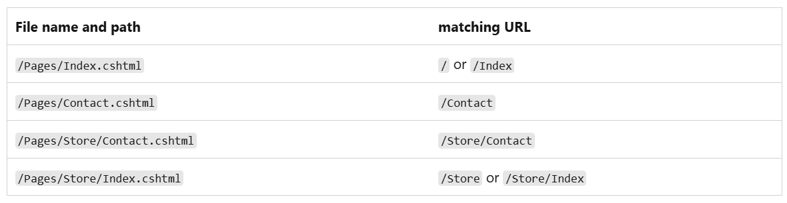
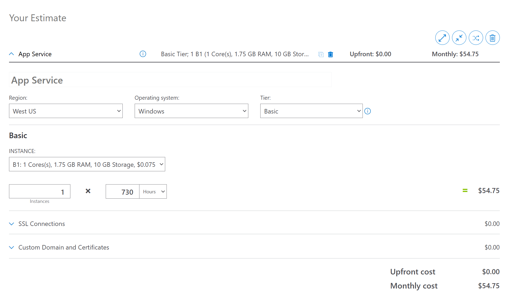
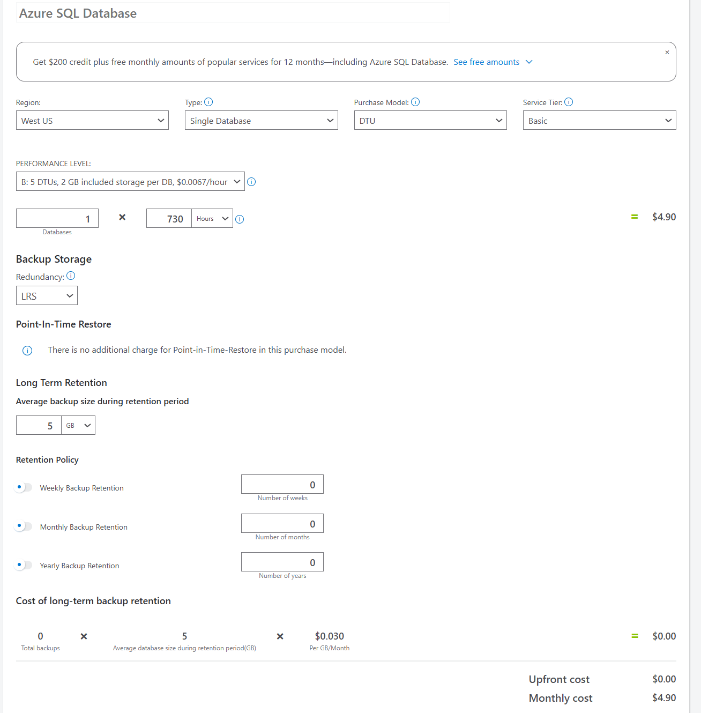
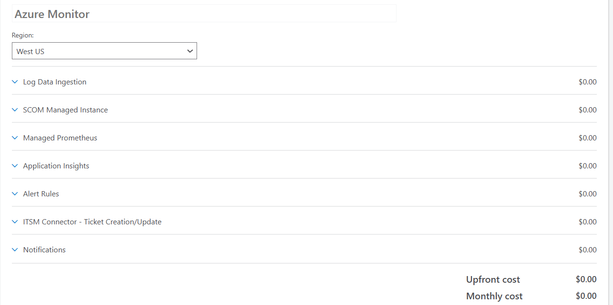
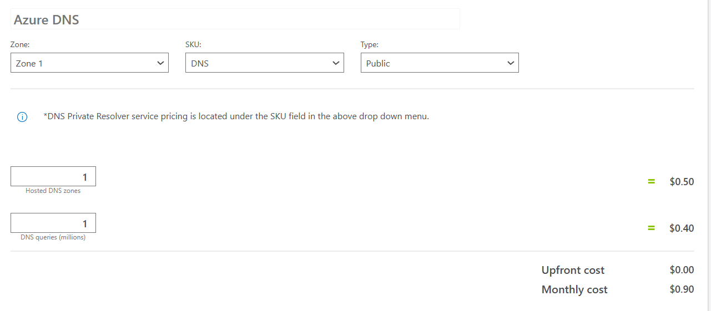

# Razor Pages

This page is for research related to Razor Pages.

---

## Table of Contents
1. [Background](#background)
   1. [What is a Razor Page?](#what-is-a-razor-page)
   2. [How Does a Razor Page Work?](#how-does-a-razor-page-work)
   3. [Project Structure](#project-structure)
   4. [Routing and URLs](#routing-and-urls)
   5. [Request Handling and Handlers](#request-handling-and-handlers)
2. [Using Razor Pages with JavaScript](#using-razor-pages-with-javascript)
   1. [Key Features](#key-features)
   2. [Example Workflow](#example-workflow)
   3. [Best Practices](#best-practices)
3. [Using Razor Pages with React and JavaScript](#using-razor-pages-with-react-and-javascript)
   1. [How They Work Together](#how-they-work-together)
   2. [Ways to Integrate React](#ways-to-integrate-react)
   3. [Example Workflow](#react-example-workflow)
4. [Prerequisites](#prerequisites)
   1. [Visual Studio](#visual-studio)
   2. [Visual Studio Code](#visual-studio-code)
5. [Pricing](#pricing)
6. [Templates](#templates)
7. [Security Considerations](#security-considerations)
8. [Sources](#sources)

---

## Background

### What is a Razor Page?
A **Razor Page** is an alternative to the traditional **MVC** (Model-View-Controller) pattern in ASP.NET Core. It’s a lightweight, page-focused programming model introduced in ASP.NET Core 2.0. Razor Pages simplify the organization of code by associating each UI page (`.cshtml` file) with its own PageModel class. This approach:
- Encourages clear separation of concerns.  
- Fosters cleaner, more maintainable code.  
- Streamlines development by reducing the need for extensive controller logic.  
- Integrates seamlessly with ASP.NET Core features such as **routing**, **dependency injection**, and **model binding**.

### How Does a Razor Page Work?
Razor Pages combine a `.cshtml` (UI) file with a PageModel class (logic) in a way that’s tightly bound to the URL structure. When a user requests a page:
1. **Routing** matches the URL to the corresponding `.cshtml` file.  
2. ASP.NET Core creates an instance of the associated **PageModel**.  
3. The framework invokes the relevant handler method (e.g., `OnGet`, `OnPost`).  
4. The PageModel handles data retrieval, business logic, or validation.  
5. The `.cshtml` file uses Razor syntax to render the final HTML, leveraging data from the PageModel.  

This keeps each page’s code self-contained and organized, minimizing the need for large, centralized controllers.

### Project Structure
- **Pages Folder**: Contains `.cshtml` files (markup) and optional `.cshtml.cs` files (PageModel classes).  
- **PageModel**: Each `.cshtml` file can have a corresponding PageModel with handler methods (`OnGet`, `OnPost`, etc.) to handle page-specific logic.  

### Routing and URLs
- **File-Based Routing**: By default, the folder and file structure under `Pages/` determines the URL path. For example, `Pages/Index.cshtml` is accessible at `/Index`.  
- **Customization**: You can override default routes with page directives, like `@page "/custom-route"`, or set up routing conventions in `Startup.cs/Program.cs`.



### Request Handling and Handlers
- **Handler Methods**:  
  - `OnGet`, `OnPost`, `OnPut`, etc. run based on the incoming HTTP verb.  
  - You can create named handlers (e.g., `OnGetDetails`) and invoke them using specialized URLs or form actions.  
- **Model Binding**:  
  - ASP.NET Core automatically binds form fields or query strings to properties in the PageModel.  
  - This significantly reduces boilerplate code for data access and form handling.

---

## Using Razor Pages with JavaScript
Source: ChatGPT

Razor Pages and JavaScript work together to enable dynamic and interactive web applications by combining server-side and client-side functionality effectively. Below is a summary of their interaction and relationship:

### Key Features

1. **Embedding Razor Data in JavaScript**
   - Razor syntax (`@...`) allows embedding server-side variables into JavaScript directly.
   - Example:
     ```html
     <script>
         const userName = "@Model.UserName";
         console.log(userName);
     </script>
     ```

2. **Dynamic Data Fetching**
   - JavaScript can use APIs like `fetch` or AJAX to communicate with Razor Page handlers (`OnGet`, `OnPost`) for dynamic data updates.
   - Example:
     ```javascript
     fetch('/MyPage/GetData')
         .then(response => response.json())
         .then(data => console.log(data));
     ```

3. **Form Submission via JavaScript**
   - JavaScript can submit data to Razor handlers for processing without reloading the page.
   - Example:
     ```javascript
     const formData = new FormData();
     formData.append('key', 'value');

     fetch('/MyPage/SubmitData', {
         method: 'POST',
         body: formData
     }).then(response => console.log(response));
     ```

4. **DOM Manipulation**
   - JavaScript can dynamically update HTML content generated by Razor Pages.
   - Example:
     ```javascript
     document.getElementById('message').innerText = 'Updated by JavaScript!';
     ```

### Example Workflow

1. **JavaScript Code (site.js):**
   ```javascript
   document.getElementById('loadButton').addEventListener('click', () => {
       fetch('/MyPage/GetMessage')
           .then(response => response.json())
           .then(data => {
               document.getElementById('message').innerText = data.message;
           })
           .catch(error => console.error('Error:', error));
   });
   ```

2. **Razor Page Markup:**
   ```html
   <button id="loadButton">Load Message</button>
   <div id="message">Message will appear here</div>

   <script src="site.js"></script>
   ```

3. **Razor Page Handler (MyPage.cshtml.cs):**
   ```csharp
   public IActionResult OnGetGetMessage()
   {
       return new JsonResult(new { message = "Hello from Razor Pages!" });
   }
   ```

### Best Practices

- **Separate Concerns:** Use Razor Pages for server-side logic and JavaScript for client-side interactivity.
- **Use APIs:** Razor handlers should return structured data (e.g., JSON) for JavaScript to consume.
- **Graceful Error Handling:** Manage errors on both server and client sides to improve user experience.

---

## Using Razor Pages with React and JavaScript

Razor Pages and React can work together seamlessly, leveraging Razor Pages for server-side functionality and React for building modern, dynamic UI components. Here’s how they integrate:

### How They Work Together

1. **Razor Pages for Server-Side Logic**
   - Handles routing, server-side logic, and API endpoints.
   - Provides structured JSON data to React components.

2. **React for Front-End UI**
   - Builds reusable and interactive components.
   - Can consume Razor Page APIs using `fetch` or `axios` for dynamic content updates.

3. **JavaScript as Glue**
   - JavaScript initializes React components and manages interactions with Razor Pages.

### Ways to Integrate React

1. **Embed React Components in Razor Pages**
   - Example:
     ```html
     <div id="react-app"></div>
     <script src="/dist/main.js"></script>
     <script>
         ReactDOM.render(<App />, document.getElementById('react-app'));
     </script>
     ```

2. **React as a Front-End SPA**
   - Razor Pages serve as the backend for API endpoints.
   - React fetches data dynamically.
   - Example:
     ```javascript
     fetch('/MyPage/GetUserData')
         .then(response => response.json())
         .then(data => console.log(data));
     ```

3. **Hybrid Approach**
   - Razor Pages render initial content; React enhances it dynamically.
   - Example:
     ```javascript
     const userInfo = document.getElementById('user-info').dataset.user;
     ReactDOM.hydrate(<UserInfo data={JSON.parse(userInfo)} />, document.getElementById('user-info'));
     ```

### React Example Workflow

1. **Razor Page Endpoint**
   ```csharp
   public IActionResult OnGetGetProducts()
   {
       var products = new[]
       {
           new { Id = 1, Name = "Product A" },
           new { Id = 2, Name = "Product B" }
       };
       return new JsonResult(products);
   }
   ```

2. **React Fetch**
   ```javascript
   useEffect(() => {
       fetch('/Products/GetProducts')
           .then(response => response.json())
           .then(data => setProducts(data));
   }, []);
   ```

3. **React Component**
   ```javascript
   const ProductList = () => {
       const [products, setProducts] = React.useState([]);

       useEffect(() => {
           fetch('/Products/GetProducts')
               .then(response => response.json())
               .then(data => setProducts(data));
       }, []);

       return (
           <ul>
               {products.map(product => (
                   <li key={product.Id}>{product.Name}</li>
               ))}
           </ul>
       );
   };

   export default ProductList;
   ```

4. **Include React in Razor Page**
   ```html
   <div id="react-product-list"></div>
   <script src="/dist/main.js"></script>
   <script>
       ReactDOM.render(<ProductList />, document.getElementById('react-product-list'));
   </script>
   ```

### Best Practices

- **Separate Concerns**: Use Razor Pages for APIs and React for UI components.
- **Build React Separately**: Use modern React build tools (e.g., Vite, Webpack).
- **Static Files**: Place React builds in the `wwwroot` folder for serving.

---

## Prerequisites

### Visual Studio
- **Visual Studio 2022** with the ASP.NET and web development workload.  
- **.NET 6.0 SDK**  

### Visual Studio Code
- **C# for Visual Studio Code** (latest version)  
- **.NET 6.0 SDK**  

> **To run a new Razor Pages project**:  
> ```bash
> dotnet new webapp
> dotnet run
> ```
> Then visit `https://localhost:5001` (or the displayed URL) to view your app.

---

## Pricing
https://azure.microsoft.com/en-us/pricing/calculator/
Selected Options (per ChatGPT recommendation)
* App Service: $54.75/month
* Azure SQL Database: $4.90/month
* Azure Monitor: $0.00/month
* Azure DNS: $0.90/month
* Total Estimated Monthly Cost: $60.55


### Possible options to make it less expensive:
* Host Elsewhere, Then Use Azure for Services
You can also run your .NET app on other cheaper hosts or in a VM:
  * Cheap Linux VPS (e.g., $5–$10/month from providers like DigitalOcean, Linode, etc.).
  * Free-tier providers (though many have usage limits).
  * Then optionally connect to Azure services (like an Azure SQL DB or Key Vault) if needed.





---

## Templates

---

## Security Considerations
- **Shared ASP.NET Core Security Model**  
  - Razor Pages rely on the same middleware and security infrastructure as MVC (authentication, authorization, identity, etc.).  
  - No unique security gaps are introduced simply by choosing Razor Pages over MVC.

- **Authorization Placement**  
  - Use `[Authorize]` attributes at the PageModel level or folder level to secure specific pages.  
  - Missing or incorrectly placed attributes can unintentionally allow unauthorized access.

- **Anti-Forgery Tokens**  
  - Built-in form tag helpers (`<form asp-page="..." method="post">`) automatically include anti-forgery tokens.  
  - If you’re creating custom forms or manually managing requests, make sure anti-forgery validation is enabled to prevent CSRF.

- **Exposed Endpoints**  
  - By default, file-based routing can make pages accessible via their folder/file structure.  
  - Restrict admin or sensitive pages with `[Authorize(Roles = "...")]` (or policy-based authorization) and place them in secure or separate folders.

- **Handling Sensitive Data**  
  - Avoid storing secrets, passwords, or access tokens directly in your PageModel.  
  - Use secure storage like Azure Key Vault or environment variables and inject them via dependency injection.

- **Validation Gaps**  
  - Razor Pages use the same data annotation and `ModelState` validation as MVC.  
  - Always validate user input, use parameterized queries/ORM to prevent SQL injection, and carefully handle user-generated output to avoid XSS.

- **Separation of Concerns**  
  - Keep business logic in separate service or repository classes to avoid overloading the PageModel.  
  - This helps maintain a clean architecture and reduces potential mistakes in handling security-related code.

---

## Sources
- [Twilio Blog: Introduction to ASP.NET Core Razor Pages](https://www.twilio.com/en-us/blog/introduction-asp-net-core-razor-pages)  
- [Microsoft Docs: ASP.NET Core Razor Pages](https://learn.microsoft.com/en-us/aspnet/core/razor-pages/?view=aspnetcore-9.0&tabs=visual-studio-code)
- [Azure Pricing Calculator](https://azure.microsoft.com/en-us/pricing/calculator/)
---

